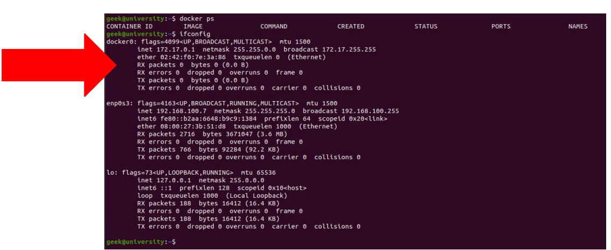
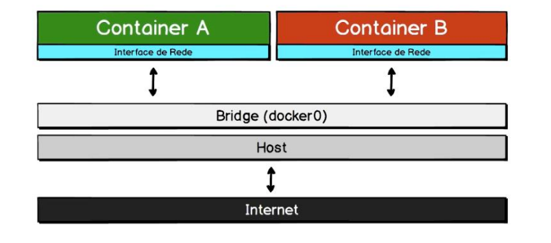

ESTUDO DOCKER
================================

Estudo em formato prático e objetivo, onde aprendo e demonstro como trabalhar com containers Docker e publicando suas aplicações com eficiência, juntamente com uma notação que poderá servir de manual rápido para o dia a dia.


********
********
NOTAÇÃO
==========

---
Básico sobre docker | Visão geral
---
#### O que são containers?
- também conhecido como "container Linux", é uma maneira de criar ambientes isolados que podem executar código enquanto compartilham um único sistema operacional.
- Cada container é completamente isolado dos outros

#### O que é o Docker?
- docker é uma aplicação que gerencia containers por trás dos panos, permitindo que a essa tarefa torne-se mais fácil.

#### Qual a diferença entre container e máquina virtual?
- Máquina virtual: precisa de uma infraestrutura (servidor), em cima vai o sistema operacional baseado em Hypervisor onde a partir dali instala-se o(s) SO(s), instala-se as libs/bins por fim adiciona-se a aplicação, o que acaba sobrecarregando a máquina necessitando cada vez mais de espaço em disco, processamento, memória ...
- Container: é uma virtualização baseada em container ou a evolução da virtualização, a partir da infraestrutura (computador, servidor, etc) temos o SO, criamos um "Container Engine" então nele são alocadas as libs/bins e por fim as aplicações, melhorando a utilização da nossa infraestrutura

#### O que precisamos para fazer uso do Docker?
- Precisaremos apenas instalar o "Docker engine" e utilizar algum editor de códigos para criar os arquivos _(nesse estudo utilizaremos o VSCode)_
- Em Linux e Mac o "docker engine" executa containers via máquina virtual, pois containers são recursos Linux.
- O docker é uma ferramenta gratuita.
- anexo arquivo "instalacao_linux.txt" como manual para instalação no linux ubuntu e debian.

***
YAML - Yet Another Markup Language
---
#### Introdução:
- Criada em 2001 é uma linguagem não apenas de marcação, mas também uma linguagem de ***Serialização de dados***.
- ***Serialização de dados*** é uma técnica que permite converter objetos em bytes _(colocando-os em série)_ após a conversão podem ser salvos em disco ou também enviados _(via http, via socket etc)_.
- Existe o processo de ***Serializar*** _(converter objetos em bytes)_ e existe ***Desserializar*** _(converter bytes em objetos)_.

#### Estudo no código
- Arquivo ["sintaxe.yaml"](sintaxe.yaml) mostra exemplos básicos sobre sintaxe, lembrando que por boa prática, nunca se usa a tecla "tab", sempre usar a barra de espaço.

#### Mapeamento
- É o que o nome sugere, mapear uma chave a um valor, representado por arrays associativos, pares de chaves/valor, tabelas hash. Em yaml são representados por ":" e espaço, sem chaves duplicadas e podem ser aninhados. No arquivo [mapeamentos.yaml](mapeamentos.yaml) podemos ver na prática.

#### Estilos
- Existem 2 tipos de estilos em yaml:
		- Bloco, que utiliza chave + valor
		- Flow, onde ficam agrupados por chaves "{ }"
- Pode-se visualizar o exemplo em ["estilos.yaml"](estilos.yaml)

#### Sequencias
- Em yaml as sequencias podem ser listas, arrays coleções ou uma combinação entre elas
- Sequencia não pode ser vazia ou com linhas em branco
- Não pode aninhar sem fazer mapeamento
- Então, sequencia é uma lista de valores, pode-se ver mais em [sequencias.yaml](sequencias.yaml)

#### Escalares
- Valores escalares são valores únicos, ex: uma string, um boolean, ou seja, diferente de um array.
- Entende-se melhor em [escalares.yaml](escalares.yaml)

#### Estruturas
- Em yaml, podemos ter multiplas diretivas ou configurações em um único arquivo
- Para fazer a separação das diretrizes sem interferir uma em outra, utiliza-se três traços "---", explica-se mlehor em [estruturas.yaml](estruturas.yaml)

#### Comentários
- Comentários são importantes para documentar o que ocorreu ou está ocorrendo no código, em yaml são representados por " # " no início da frase

#### Tags
- Em yaml para configurar uma uri ou url usando um prefixo "%TAG"
- Configura-se tags locais
- Quanto algum software fizer a leitura do arquivo ".yaml", ele vai ver que existe uma tag, a qual informa o host então irá obter o valor 'location' conforme exemplo [tags.yaml](tags.yaml)

#### Âncoras
- Em yaml usamos âncoras para armazenar e reutilizar dados
- Define-se uma âncora com o "&"
- Para referenciar/fazer uso, utiliza-se o "*"
- Veja exemplos em [ancoras.yaml](ancoras.yaml)
---
Docker e imagens
---
#### O que são imagens em um container?
- Quando fala-se em container, imagens são os "templates" na qual usamos para criar os containers
- Quando o comando "docker run imageName" é executado, o docket tenta encontrar localmente, caso não consiga, ele tenta encontrar no docker hub.
- Uma imagem é criada a partir de um arquivo chamado "Dockerfile"<sub> _(dockerFile: são instruções linha a linha, na qual informam como criar uma imagem)_</sub>

#### Sistema de aquivos em camada
- Um dos tópicos mais importantes do **docker** é o *filesystem*, ou seja, o sistema de arquivos utilizado pela ferramenta.
- O sistema de arquivos do **Docker** é chamado de **Layered**, ou seja, é um sistema de arquivos em camadas.

#### Sistemas de arquivos no docker
- A camada de escrita que o processo/apliacação visualiza não é o mesmo rootfs base do sistema, mas sim uma camada de abstração do rootfs <sub>_(rootfs: é o local onde fica o sistema de boot do sistema operacional e o kernel)_</sub> 
- No docker temos esta arquitetura também, mas um pouco diferente:
		- A camada de escrita que o processo/aplicação visualiza não é o mesmo rootfs base do sistema mas simuma camadadeabstração do rootfs.
		- Isso faz com que um container torne-se portável, pois as modificações realizadas não são aplicadas ao sistemaorigemdocontainer e sim na camada a qual o sistema visualiza.
- Imagens são compartilhadas entre containers Docker
		- Este tipo de sistema de arquivos em camadas busca sempre a eficiência. Desta forma, containers compartilham imagens semelhantes.

#### Comandos docker

``` shell
	$ docker --version
# Mostra a versão instalada
```

```shell
	$ docker --help
# ajuda
```

```shell
	$ docker container --help
# ajuda sobre comando container
```

```shell
	$ docker container ls
# lista os containers
```

```shell
	$ docker ps
# lista os containers que estão em execução
```

```shell
	$ docker ps -a
# lista os containers que estão em execução e também os containers que estão parados
```

```shell
	$ docker start nomeContainer
# inicializa um container
```

```shell
# exemplo para baixar um container (postgres nesse caso)
	$ docker pull postgres
	
# vai apenas fazer o download da imagem e não irá executar

```

```shell
# baixar e executar um container (postgres por exemplo)
	$ docker run postgres
		
```

```shell
# listas as imagens baixadas (instaladas ou não)
	$ docker image ls
```

```shell
# remover uma imagem
	$ docker image rm image_id
	
# se a imagem estiver em uso, o docker não vai permitir a remoção dela, então pode-se remover forçadamente
		$ docker image rm image_id -f
```

###### Observação:
- Não baixar versão em "latest", informar corretamente a versão, _(recomendação)_ primeiramente acesse a imagem pretendida baixar <a href="https://hub.docker.com/_/postgres?tab=tags" target="_blank">hub.docker.com/_/postgres</a> e veja qual a última versão _(tag)_ no site mostra o comando correto
- Exemplificando com postgres:
```shell
# baixando corretamente fixando a versão da imagem
	$ docker pull postgres:9.6.24-bullseye

# desse modo estará fixada a versão na qual estarei usando
# No momento que for especificada a versão sabe-se exatamente qual versão utilizada, se estiver como "latest" pode ser qualquer versão que for a última.
```

```shell
# fazendo inspeção da imagem:

	$ docker image inspect 'image_id'
# pode-se usar apenas os 3 primeiros dígitos da image_id
```

```shell
# Criar uma imagem baseada em uma existente
	$ docker image tag  postgres:13.1 'nomeDaTagQueQueroCriar'
```

```shell
# baixando uma imagem ubuntu:
	$ docker pull ubuntu:22.04

# executando o container do ubuntu
	$ docker run ubuntu
	# vai executar e encerrar, já que não executa nenhum serviço

# executando o container ubuntu e fazer ele imprimir saída na tela
	$ docker run ubuntu echo "texto a ser impresso na tela"
	# ao finalizar irá encerrar o container
```

#### Acessando a porta do container
- Em exemplo vamos rodar o configurar o Nginx _(servidor web)_
```shell
# vamos baixar e executar a imagem, sem ficar utilizando o terminal
	$ docker run -d -e NGINX_ENTRYPOINT_QUIET_LOGS=1 nginx:1.21.6
```

- Nesse caso ao colocar _"http://localhost/"_ no navegador não vamos conseguir acessar a porta 80 do nginx, porque ele está rodando no container e não no nosso pc
- É necessário fazer um espelhamento _(mirror)_ do pc para o container, então:
```shell
	$ docker run -d -p 8080:80 nginx:1.21.6-alpine
# executar usando a porta 8080 (do meu pc) para ( : ) 80 do nginx

# no navegador abrir "http://localhost:8080" então estaremos na tela do nginx
```

#### Os containers não persistem dados
- Quando cria-se um container, após inserimos algum arquivo nele, ao sair o container será encerrado, ao reabrir o container, o arquivo não existirá.
- Se a imagem na qual o container foi criado não contém por padrão persistência de dados habilitada, o conteúdo criado será perdido.

##### Solução:
- Para persistência de dados em containers são os ***volumes*** ou também chamados de ***volumes de dados***

#### Persistência de dados -> _Volumes_
```shell
# rodar container "linux-alpine"
	$ docker run --name linux_alpine --rm -i -t alpine:3.15.0 sh
	
# cria um container com nome "linux_alpine" versão "3.15.0" e execute o shell "sh"

```

#### O que são volumes em um container?
- Volumes são a solução perfeita para nós desenvolvedores, pois se antes por exemplo tínhamos que instalar um servidor web e um banco da dados diretamente na nossa máquina ou criar uma máquina virtual com estes servidores, agora podemos fazer uso de containers, por exemplo, um para servidor web e um para banco de dados, e termos os arquivos de desenvolvimento para trabalho local.
- ***Obs:*** Os arquivos/diretórios expostos estão na sua máquina (host) e não no container. Desta forma qualquer modificação neles a persistência é feita no seu computador e não no container.

#### Criando volumes no Docker
- Primeiramente executando um container em 2 formas:
```shell
# executar um container servidor web nginx, e não mostrar os logs de execução:
	$ docker run --name servidor_web -d -e NGINX_ENTRYPOINT_QUIET=1 nginx:1.21.6
	
# agora executando um containser servidor web, mapeando o diretório fazendo uso de um volume em: "/home/user/volumes_docker/servidor_web/"
	$ docker run -v /home/user/volumes_docker/servidor_web/ --name servidor_web -d -e NGINX_ENTRYPOINT_QUIET=1 nginx:1.21.6
```

- Executando comandos no container em execução:

```shell
# docker executar de forma "iterativa" o "servidor_web" no "shell"
$ docker exec -it servidor_web sh

# acessar então a pasta configurada no volume do container "/home/user/volumes_docker/servidor_web/"

# então agora pode-ser persistir os dados neste diretório.

# após isso, vamos parar o container em execução
$ docker container stop servidor_web

# checar se realmente está encerrado
$ docker ps -a

# vamos executá-lo novamente e testar se o arquivo persitido existe:
$ docker container start servidor_web

# executar shell de forma iterativa novamente:
$ docker exec -it servidor_web sh

# acessar o diretório "/home/user/volumes_docker/servidor_web/"
$ cd /home/user/volumes_docker/servidor_web/

# verá que o arquivo está no mesmo local

```

- ***Obs:***  Conforme o procedimento executado acima, o container não pode ser removido, apenas parado e reiniciado

#### Montagem do volume, especificando _"diretório do container <-> diretório do host"_
```shell
# executar container de --name "servidor_web" -d -p colocando da "porta_8080_localhost:na_Porta_80_do_Container" -e _não_mostrar_logs -v "do_diretórioVolumeDoHost:diretório_Volume_no_container" imagem_nginx:versao-alpine
$ docker run --name "servidor_web" -d -p 8080:80 -e NGINX_ENTRYPOINT_QUIT_LOGS=1 -v "/home/joao/volumes_docker/servidor_web:/usr/share/nginx/html" nginx:1.21.6-alpine-perl
#Obs: diretório informado no container é o padrão quando se usa nginx

# verificar se está rodando:
$ docker ps

# para testar então, vamos acessar no navegador a porta 8080(host) para visualizar a página "index.html" que está em '/usr/share/nginx/html'

# Precisando acessar via shell o volume no container
# docker executar de forma iterativa o "servidor_web" no sh (shell)
$ docker exec -it servidor_web sh
```
- ***Obs.:*** desse modo os dados permanecerão persistidos mesmo se o container for removido
#### Inspecionando um container
- Para visuzliar informações do container, volume, diretório de montagem e etc
```shell
# após exscutar o comando, basta localizar no log o parágrafo "Mounts" irá mostrar: 'Source': diretório do volume no localhost 'Destination': local no container
$ docker inspect 'container_id'
```

```shell
# Visualizar consumo de hardware do container
$ docker stats
```

#### DockerFile: o que é dockerfile
- DockerFile >> arquivoDocker
- É um arquivo texto escrito na linquagem yaml, onde colocamos instruções para gerar uma imagem

#### Dockerfile: criando um dockerfile
###### Exemplo criando um dockerfile simples para gerar container de um servidor web nginx
- No diretório do projeto criar um arquido do tipo "Dockerfile", então foi gerado o arquivo chamado <a href="https://github.com/jfpadilha/estudo-docker/blob/master/dir_dockerfiles/servidor_web_nginx.Dockerfile" target="_blank">servidor_web_nginx.Dockerfile </a>
- Neste arquivo _"Dockerfile"_ foi informado as instruções para geração da imagem:
```yaml
FROM nginx:1.21.6-alpine # imagem base e versão
LABEL maintainer="Estudo docker: jfpadilha@gmail.com" # Identificação e mantenedor do projeto
COPY . /usr/share/nginx/html # quado montar a imagem copiar tudo para o diretório do dockerFile ( . )
EXPOSE 80 # a porta 80 do container deve ficar disponível
```
- Próximo passo, usando terminal, acessar o diretório onde está o arquivo "Dockerfile"
- Vamos executar o comando:
```yaml
# buid >> gerar imagem a partir de um dockerfile
# -f >> para informar qual o nome do dockerfile
# -t >> nome__de_user_no_dockerhub/nome_da_imagem:tag_que_desejar
# " . " _ponto_ estamos informando para o dockerbuild o local do arquivo na qual está sendo gerado esse build (no caso no mesmo diretório)
$ docker build -f servidor_web_nginx.Dockerfile -t seu_username/servidor_web_nginx:v1 .
```
- Após rodar o comando com sucesso, nota-se que foi executado em 4 steps, justamante devivo ao arquivo dockerfile conter 4 linhas de instruções
- Cada step gera um id
- Cada id é referente a uma camada no sistema de arquivo de camadas do docker

```shell
# executando e testando a imagem gerada
$ docker run --name "servidor_web_nginx" -d -p 8080:80 seu_username/servidor_web_nginx:v1
```

#### Dockerfile >> Publicando a imagem no Docker Hub
- Após gerada e verificado que está tudo correto com a imagem, podemos publicar em nosso espaço no <a href="https://hub.docker.com" target="_blank">hub.docker.com</a>, para isso faz se necessário possuir cadastro, após isso no shell:

```shell
$ docker login --username=seu_username
# após informe sua senha
```

```shell
# subindo a imagem para o hub
	$ docker image push seu_username/servidor_web_nginx:v1
```
- Após rodar o comando, ele irá preparar as camadas e enviará em sequência.

#### Dockerfile >> criando dockerfile 2 para exemplo
- Arquivo [python_django.Dockerfile](https://github.com/jfpadilha/estudo-docker/blob/master/dir_dockerfiles/python_django.Dockerfile), projeto chamado "fusion"

```yaml
FROM python:3.11.0a5-alpine3.15
LABEL maintainer="Estudo docker <jfpadilha@gmail.com>"
COPY . /var/www
WORKDIR /var/www
RUN apk update && apk add zlib-dev jpeg-dev gcc musl-dev && pip install -r requirements.txt && python manage.py migrate
ENTRYPOINT python manage.py runserver 0.0.0.0:8000
EXPOSE 8080

  
# -------- Explicação dos comandos acima:

# linha 1 -> linguagem e versão

# linha 2 -> mantenedor

# linha 3 -> copiar tudo ( . ) para /var/wwww

# linha 4 -> diretório de trabalho, na qual a apliucação vai estar funcional

# linha 5 -> executar update && adicionar bibliotecas e requisitos && "pip" é um gerenciador de pacotes do python, instalar eles a partir desse arquivo de requerimentos && executar o arquivo manage.py e "migrate" para criar banco de dados

# linha 6 -> comando que é executado no workdir, assim que o container é criado, após criar o container, qual comando será executado? nesse caso executar o server na porta 8000

# linha 7 -> é espoxta na porta 8000
```

- Arquivo tipo "Dockerfile" criado, então é hora de executar o build
```shell
	$ docker build -f python_django.Dockerfile -t seu_username/fusion:v1 . # ( . ) no final

# se o nome do arquivo tipo dockerfile for renomeado com apenas "Dockerfile" não é necessário o comando "-f nome"
```

- Após vamos conferir a imagem gerada e na sequencia rodar ela para efetuar os testes
```shell
# vericicando se existe algum container relacionado rodando:
	$ docker ps

# Caso existir pode-se encerrar ou remover

# após vamos executar o comando "run" para executar o serviço e testar a aplicação
	$ docker run --name "fusion" -d -p 8080:8000 seu_username/fusion:v1
```

#### Como funciona a comunicação em uma rede no Docker
- Quando trabalhamos com Docker este cria uma rede interna, em outra classe, e distribui IPs aos containers criados.
- Visualizar as redes no terminal linux:
 ```shell
 	$ ip addr
 ``` 
 
 
 - Após rodar o comado veremos as informações referente as placas de rede do seu computador, juntamente com  a rede ***"docker0:"*** esta é a bridge do docker, no qual faz a ponte entre as camadas: containers, Bridge, host e a internet, conforme imagem abaixo:
 
 ##### Outros tipos de rede no docker:
 - Além do modelo padrão "brigde", o docker ainda disponibiliza os seguintes tipos:
		 - *None network:* não haverá nenhuma rede;
		 - *Host network:*, ao invés de utilizar a bridge (ponte) entre os containers e o host, o acesso é direto entre o container e o host;
		 - *Overlay network:* usado com o docker swarm que é o orquestrador de containers <sub> *(lembrando que o kubernetes é o  orquestrador de containers padrão no mercado atual).*</sub>

#### Criando uma rede para comunicação:
- Listando as redes no docker
```shell
	$ docker network ls
```
- criando um container com linux alpine sem designar ip
```shell
# executar container e após execução remover (--rm) / linux alpine / executar o shell (sh) / rodar o comando (-c) ifconfig
	$ docker run --rm alpine:3.15.0 sh -c "ifconfig"

# vai rodar o linux, executar o comando, mostrar as informações da rede e por sua vez irá encerrar a aplicação
```
- executando um container com linux alpine mas agora especificando qual ip da rede
```shell
# executar sem rede (--net none)
	$ docker run --net none --rm alpine:3.15.0 sh -c "ifconfig"

# somente vai mostrar a rede interna, vai ficar sem rede, sem comunicação com o host
```
- acessando rede do host estando no container
```shell
# executar um container e rodar nele (ifconfig), irá mostrar as configuraçoes de rede do host, o mesmo que "ifconfig" ou "ip address"
	$ docker run --net host --rm alpine:3.15.0 sh -c "ifconfig"
```
- Inspecionando uma rede
```shell
# inspecionar a bridge:
	$ docker inspect network bridge

# para visualizar as redes que podem ser inspecionadas, deve-se listá-las para visualizar
# observar os itens> "subnet" e o "gateway"
```
- E se tiverem vários containers, eles se comunicam?
```shell
# testando: executar 3 containers, linux alpine, executando em background (-d) e deixá-lo executando por 5 mil segundos
	$ docker run --name "container_1_bridge" -d alpine:3.15.0 sleep 5000
	
	$ docker run --name "container_2_bridge" -d alpine:3.15.0 sleep 5000
	
	$ docker run --name "container_3_bridge" -d alpine:3.15.0 sleep 5000
```
- Após os 3 containers rodando, vamos acessá-los e testar alguns comandos
```shell
# acessando (executando) o container 1 e visualizar sua rede
	$ docker exec -it "container_1_bridge" ifconfig
	
# agora vamos acesar o container 2 em forma interativa (-it)
	$ docker exec -it container_2_bridge sh

# agora estamos em modo de comando, vamos executar ping para container 1
	 $ ping 172.17.0.2
# nota-se que está realmente comunicando

# agora executando ping para fora "google.com"
	 $ ping google.com
# também terá acesso, já que a bridge está gerenciando e possibilitando o acesso para fora
# repetindo os testes de todos para todos os containers, todos estão comunicando
```

- Lembrando que já se pode executar o container que está rodando em segundo plano e ao mesmo tempo rodar comando ping
```shell
$ docker exec -it container_2_bridge ping 172.17.0.2
```

- Criando  novas faixas de ips
```shell
# informar o driver (bridge)
	$ docker network create --driver bridge "nome_da_faixa"

# vamos visualizar a lista das redes
	$ docker network ls
	
# vamos inspecionar a nova faixa
	$ docker inspect nome_da_faixa
```
- Testando a comunicação nessa entre as faixas
```shell
# primeiramente precisa-se cirar um container nela
# rodar em background (-d) e ficar executando por 5000 segundos
	$ docker run --name "container_10_bridge_nome_da_faixa" -d --net nome_da_faixa alpine:3.15.0 sleep 5000
	
# vamos acessar esse container e executar ping para um container de outra faixa, exe: 172.17.0.2
	$ docker exec -it conta container_10_bridge_nome_da_faixa ping 172.17.0.2
# notamos que não vai ser possível acessar, já que ele está em outra faixa, mas ambos estão com acesso ao host
```
- E se quiser liberar acesso entre os containers que estão em faixas diferentes?
```shell
	$ docker network connect nome_da_faixa nome_do_container_a_conectar
# então cria-se uma ponte entre a faixa e o container

# agora vamos testar a comunicação entre os containers que estão em faixa diferente
# acessando (exec) container a primeira faixa e pingar ele no container da segunda faixa
	$ docker exec -it nome_do_container_a_conectar ping ip_do_container_de_outra_faixa
	
# checando as interfaces
	$ docker exec -it nome_do_container_faixa_diferente ifconfig
# nota-se que agora ele possui 2 faixas de ip no mesmo container
```
- E se quiser desconectar os containers que estão em faixas diferentes e comunicando?
```shell
	$ docker network disconnect bridge nome_do_container
```

#### Criando imagem e container de um projeto com banco de dados postgres
- Após o projeto estar devidamente em seu local de edição de projeto;
- Estar com o arquivo "dockerfile" criado, (no nosso caso ele é chamado de "pgfusion_postgres.dockerfile");
- Vamos rodar o comando "docker build..." para criar a imagem
```shell
	$ docker build -f pgfusion_postgres.dockerfile -t jfpadilha/pgfusion_postgres:V1 .
	
	# docker build -f nome_do_arquivo_dockerfile -t nome_do_user_no_dockerhub/nome_do_projeto:tag_versao local_do_projeto ( . nesse caso no mesmo dir) 
```
- Checando se a imagem aparece na lista
```shell
	$ docker imagem ls
```

- Agora criando a imagem do projeto web
```shell
	$ docker build -f fusion_postgres.dockerfile -t jfpadilha/fusion_postgres.dockerfile:V1 .
```
- Nota-se que gerou erros, devido ao banco de dados ainda não estar rodando, ele tenta conectar ao banco, mas ele não existe.
- O que fazer? criar um container com o banco de dados que a aplicação precisa
```shell
	# criando a imagem do banco de dados
	$ docker run --name "pgfusion_postgres" -d jfpadilha/pg_gusion_postgres:V1 .
```
- Agora que o container está executando, podemos visualizar em:
```shell
	$ docker ps
	# container em execução
```
- Notamos que no comando "run" não foi informado qual porta será mapeada, ou seja, localmente não será acessado do host.
- Consultando o ip do container
```shell

# executar de modo iterativo (-it) e rodar o comando "ifconfig"
	$ docker exec -it pgfusion_postgres ifconfig
```

```shell
```